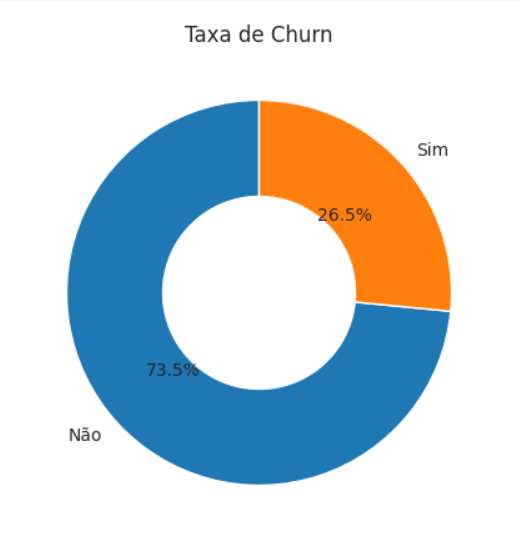
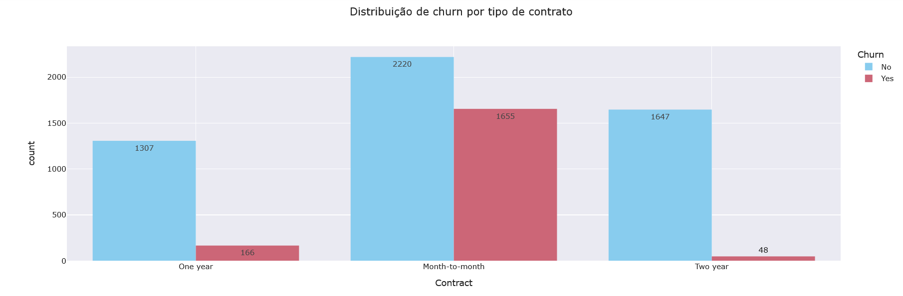
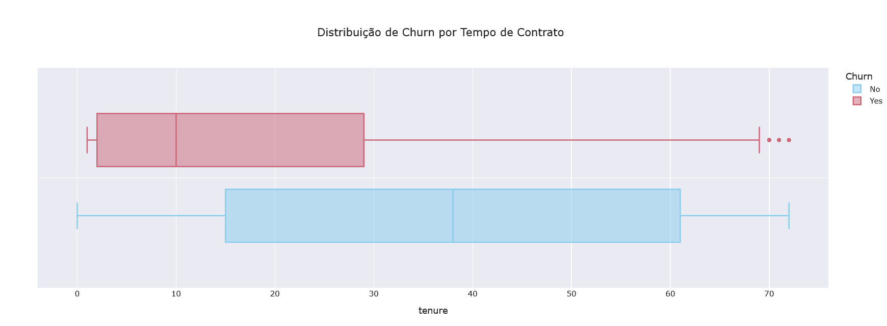
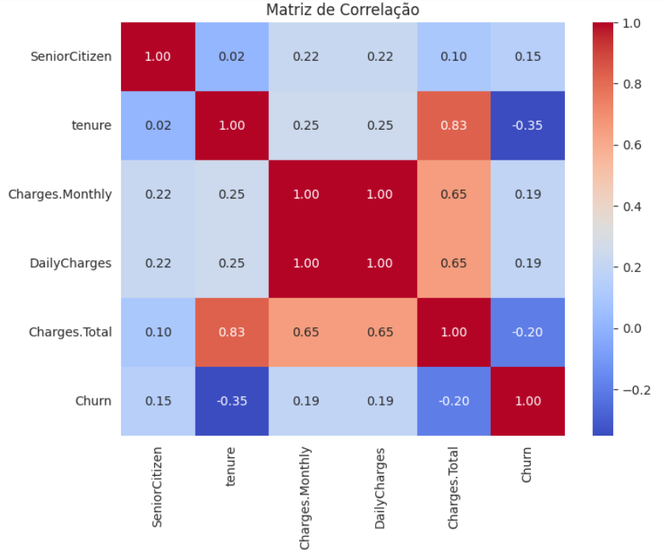
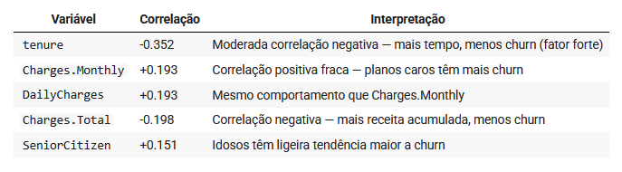

# 📊 Telecom X – Parte 1: Análise de Evasão de Clientes Exploração e Preparação dos Dados
---

## 📌 Descrição do Projeto  
Este repositório contém a primeira etapa do projeto de análise de churn em uma empresa de telecomunicações. O foco aqui está na exploração detalhada dos dados, limpeza, tratamento e análise estatística para compreensão dos fatores que influenciam a evasão dos clientes.  

A modelagem preditiva e a aplicação de técnicas de machine learning serão realizadas em um repositório separado, conforme as diretrizes do programa Oracle One Next Education + Alura para o desafio.  

## Tecnologias Utilizadas  
- Python 3.x  
- Pandas, NumPy (manipulação e análise de dados)  
- Plotly Express (visualização interativa)  
- Scipy (testes estatísticos)  
- Jupyter Notebook / Google Colab (ambiente de desenvolvimento)  

## Principais Insights da Análise Exploratória  
- Clientes com **contratos mensais** têm maior probabilidade de churn em relação a contratos de um ou dois anos.  
- Pagamentos por **boleto** estão associados a maior evasão, enquanto métodos automáticos (débito ou cartão) indicam maior retenção.  
- O serviço de **Internet por fibra óptica** mostra maior churn comparado a DSL ou ausência de serviço.  
- Tempo de permanência na base (**tenure**) apresenta forte correlação negativa com churn, evidenciando que clientes de longo prazo têm menor risco de cancelar.  
- Clientes classificados como **SeniorCitizen** apresentam maior propensão à evasão.  
- Valores mensais mais altos pagos tendem a estar associados a maior churn, apontando para potenciais desafios na precificação ou percepção de valor.

---

  ### Distribuição de Churn (evasão vs permanência)
  

  ---
  ### Churn por Tipo de Contrato
  

  ---
  ### Boxplot de Churn por Tempo de contrato (Tenure)
   

  ---
  ### Heatmap Matriz de Correlação (Pearson)
  
  
 ---  
 ### Tabela de correlação de variáveis

 
## Metodologia e Etapas Desenvolvidas  
1. **Importação e limpeza dos dados:** tratamento de dados inconsistentes, padronização de categorias e criação de variáveis derivadas (ex.: cobrança diária).  
2. **Análise exploratória e estatística:** análise descritiva, testes estatísticos (Qui-quadrado, V de Cramer), análise de correlações e visualizações para validar relações entre variáveis e churn.  
3. **Preparação para modelagem:** tratamento inicial das variáveis categóricas (substituição de valores específicos) e criação da variável alvo binária para churn.  

## Próximos Passos  
A modelagem preditiva será conduzida em um repositório separado, onde técnicas de machine learning serão aplicadas para previsão do churn e avaliação dos modelos.  

