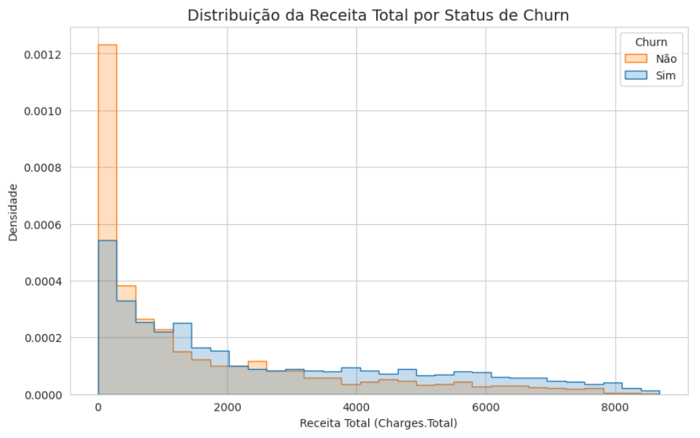

# 📊 Telecom X – Parte 1: Análise de Evasão de Clientes Exploração e Preparação dos Dados (Análise de Dados)

## 📌 Descrição do Projeto  
Este repositório contém a primeira etapa do projeto de análise de churn em uma empresa de telecomunicações. O foco aqui está na exploração detalhada dos dados, limpeza, tratamento e análise estatística para compreensão dos fatores que influenciam a evasão dos clientes.   

A modelagem preditiva e a aplicação de técnicas de machine learning serão realizadas em um repositório separado, conforme as diretrizes do programa Oracle One Next Education + Alura para o desafio.  

📊 [Veja o projeto completo aqui](https://github.com/GleiceAraujo22/telecom_x_data-analysis-challenge2/blob/d1eb3c67e6d3e119bc9d98ad0c85e05d964fa243/notebooks/Telecomx_projeto_churn_parte1_analise.ipynb)

## 🛠 Tecnologias Utilizadas  
- Python 3.x  
- Pandas, NumPy (manipulação e análise de dados)  
- Plotly Express (visualização interativa)  
- Scipy (testes estatísticos)  
  
## 🔍 Metodologia 
A abordagem envolveu: 

* EDA (Exploratory Data Analysis): Com análises univariadas e bivariadas para identificar padrões e correlações nos dados.
* Estatística Inferencial: Foi realizado testes de hipóteses para variáveis categóricas (chi-quadrado) para entender a associação das features com a variável alvo.

## 📊 Principais Análises e Resultados   
A análise dos dados de churn revelou padrões importantes que auxiliam a gestão a melhorar a retenção de clientes. Os principais insights foram: 

- **O tipo de contrato tem influência na retenção:** Clientes com **contratos mensais** têm maior taxa de churn em relação a contratos de 1 ou 2 anos.  
- **A forma de pagamento influencia na evasão:** Pagamentos por **boleto** estão associados a **maior evasão**, enquanto métodos automáticos (débito ou cartão) indicam maior retenção.  
- **Possíveis problemas no serviço de fibra óptica:** O serviço de **Internet por fibra óptica** mostra maior churn (41.89%) comparado a DSL ou ausência de serviço de internet.  
- **Quanto mais antigo o cliente menor o risco de cancelamento:** Tempo de permanência na base (**tenure**) apresenta forte correlação negativa com churn, evidenciando que clientes de longo prazo têm menor risco de cancelar.  
- **Ticket médio e valor total acumulado:** Valores mensais mais altos pagos tendem a estar associados a **maior churn**, apontando para potenciais desafios na precificação ou percepção de valor.

---

  ### 1. Distribuição de Churn (evasão vs permanência) 
  
  

  A análise demonstrou que a variável alvo possui desbalanceamento entre as classes o que é natural para este tipo de problema.
  
  ---
  ### 2. Status de Churn por Tipo de Contrato 
  
  

  Contratos mensais apresentam maior taxa de churn em comparação a contratos anuais ou bienais. 
  
  ---
  ### 3. Distribuição de Tempo de contrato(Tenure) por Grupo Churn
  
    

 Os clientes que cancelam têm, em média, cerca de metade do tempo de permanência em relação aos que não cancelam. Isso sugere que clientes mais novos na base são mais propensos a churn que é um padrão que costuma aparecer em bases de telecom, onde o churn é mais alto nos primeiros meses. O tempo de permanência é uma variável fundamental para previsão de churn além de segmentação e para análise do ciclo de vida. 

  --- 
### 4. Distribuição de Receita Total por Grupo Churn 

 

O histograma mostra que a  distribuição é assimétrica a direita ou seja, muitos clientes estão concentrados em faixas baixas de gastos totais o que muito provavelmente está ligado ao tempo de contrato do cliente e o ticket médio.

---
  ### 5. Heatmap Matriz de Correlação (Pearson)
  
  
 ---  
 ### 6. Tabela de correlação de variáveis 
 
 

Com relação a correlação entre as variáveis independentes, (Charges.Monthly) e (Charges.Total) possuem correlação positiva quase perfeita ≈99 o que indica que são praticamente a mesma coisa por isso para evitar a multicolinearidade no modelo de machine learning, seria interessante avaliar neste caso, a exclusão de uma dessas variáveis para reduzir a multicolinearidade. Essa análise será realizada de forma mais profunda na parte 2 deste projeto. 

### 7. Avaliação de associação entre variáveis categóricas 
Foi aplicado um teste estatístico qui-quadrado (χ²) para medir a associação entre as variáveis categóricas em relação a variável alvo (churn) onde: 

    Qui-quadrado → mede a discrepância entre as frequências observadas e as esperadas.

    p-valor → indica se a associação com o Churn é estatisticamente significativa (quanto menor, mais forte a evidência de associação).

    V de Cramér → mede a força da associação (0 a 1), sendo:

     0.00 a 0.10 → associação fraca ou desprezível

     0.10 a 0.30 → associação moderada

     0.30 → associação forte

| Variável          | Qui-quadrado | p-valor            | V de Cramer |
|-------------------|--------------|--------------------|-------------|
| Contract          | 1184.596572  | 5.863038e-258      | 0.409798    |
| InternetService   | 732.309590   | 9.571788e-160      | 0.322037    |
| PaymentMethod     | 648.142327   | 3.682355e-140      | 0.302677    |
| PaperlessBilling  | 258.277649   | 4.073355e-58       | 0.191141    |
| OnlineSecurity    | 205.633104   | 1.232098e-46       | 0.170467    |
| TechSupport       | 190.166842   | 2.923567e-43       | 0.163898    |
| Dependents        | 189.129249   | 4.924922e-43       | 0.163448    |
| Partner           | 158.733382   | 2.139911e-36       | 0.149663    |
| OnlineBackup      | 47.260854    | 6.214093e-12       | 0.081051    |
| DeviceProtection  | 30.513395    | 3.315693e-08       | 0.064738    |
| StreamingTV       | 27.862522    | 1.302484e-07       | 0.061762    |
| StreamingMovies   | 26.251336    | 2.997474e-07       | 0.059882    |
| MultipleLines     | 11.330441    | 3.464383e-03       | 0.036400    |
| PhoneService      | 0.915033     | 3.387825e-01       | 0.000000    |
| gender            | 0.484083     | 4.865787e-01       | 0.000000    |

Podemos observar com os resultados dos testes Qui-quadrado e V de Cramér as relações estatísticamente significativas( onde o p < 0.05), além da força das relaçoes de algumas variáveis com relação ao churn.
Por exemplo, variáveis como Contract, InternetService, PaymentMethod, PaperlessBilling, OnlineSecurity, TechSupport, Dependents, Partner mostram forte evidência de associação com o churn de clientes. Algumas dessas associações já haviamos percebido anteriormente como é o caso da variável Contract onde clientes que possuem contratos mensais tendem a abandonar mais o serviço comparado a clientes cujo o contrato é anual ou bienal. 

## ⚙️ Próximos Passos  
A modelagem preditiva será conduzida em um repositório separado, onde técnicas de machine learning serão aplicadas para previsão do churn e avaliação dos modelos com base nos dados que foram tratados até aqui.

